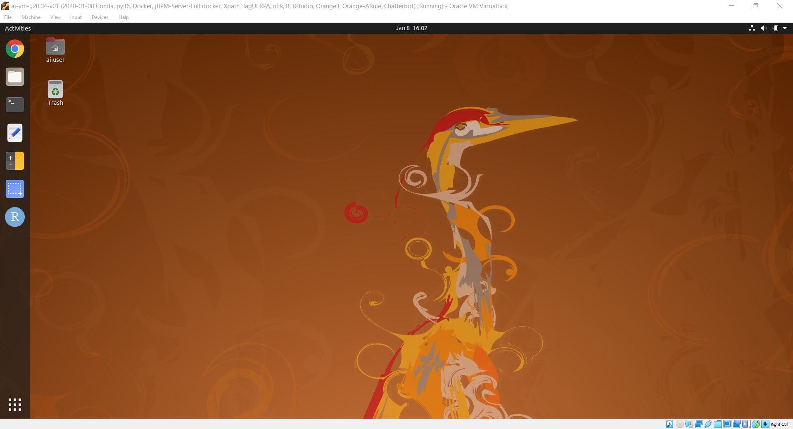

# < User Guide for ai-vm Ubuntu 20.04 >

### Installation steps:
* .1. Download and install Virtualbox software: https://www.virtualbox.org/wiki/Downloads
* .2. Download and ai-vm virtual machine (**ai-vm-vNN.ova** Appliance image file) from: 

	https://drive.google.com/drive/folders/1vdl-QMyRy6YkqzHDOAHKz2N8jFCMbfaj?usp=sharing ( 12 GB in file size )

* .3. Put the .ova file(s) in one hard disk folder.

* **[Note] Please check/ensure the 'virtualization' option is enabled in your computer's BIOS/hardware (Google it if not sure)**

* .4. Start Virtualbox software
* .5. Click File -> Import Appliance

* .6. Click Start to use ai-vm

`user id: ai-vm`
`password: ai-vm`

# < User Guide for iss-vm Ubuntu 16.04 >

### Installation steps:
* .1. Download and install Virtualbox software: https://www.virtualbox.org/wiki/Downloads
* .2. Download and iss-vm virtual machine (an Appliance) from: 

	http://bit.ly/iss-vm-v20a   ( part 1 about 11 GB in file size )

	http://bit.ly/iss-vm-v20b   ( part 2 about 11 GB in file size )

	http://bit.ly/iss-vm-v20c   ( part 3 about 10 GB in file size )

* .3. Put all three zip files in same folder; select the first file iss-vm-vNN.zip.001; use tools like 7-zip to uncompress. https://www.7-zip.org/download.html

* **[Note] Please check/ensure the 'virtualization' option is enabled in your computer's BIOS/hardware (Google it if not sure)**

* .4. Start Virtualbox software
* .5. Click File -> Import Appliance

* .6. Click Start to use iss-vm

`user id: iss-vm`
`password: iss-vm`

* .7. Data science software are on the desktop

### This iss-vm Ubuntu 16.04 contains contains:

* Anaconda-Linux-x86_64
* casperjs (and phantomjs) on ubuntu
* CLIPS (Rule Based Expert System)
* DeepMind PySC2 - StarCraft II Learning Environment
* Docker
* durable-rules
* Eclipse IDE
* Git (Git Bash)
* Google APIs Client Library for Python: google-api-python-client
* Google Cloud SDK: gcloud & datalab 
* JBoss KIE 7.12
* Jupyter Notebook
* Jupyter R kernel
* keras
* Maven
* MongoDB Node.js npm
* MySQL
* nltk & nltk data : nltk.download('popular')
* Orange
* Orange3-Associate
* pip
* pip install face_recognition
* Python 2.7 in conda environment: iss-env-py2
* Python 3.6 in conda environment: iss-env-py3
* R 3.6.1 in conda environment: iss-env-py3
* pytorch
* R 3.6.1
* R Rattle
* R Studio
* Redis
* Robotic Operating System (ROS) Kinetic
* ROS Kinetic
* scikit-learn
* Sikuli: visual recognition to automate desktop applications
* Solver (Nonlinear Programming / Genetic Algorithms) for LibreOffice
* spaCy
* Spyder
* TagUI
* TagUI-Python
* tensorflow
* Weka
* wmctrl
* xdotool

---

linux machine name                  : iss-vm 

linux user id                       	: iss-user 

linux user password                	: iss-user 

anaconda python 3 environment : iss-env-py3 

anaconda python 2 environment : iss-env-py2 

MySQL user id                       	: iss-user 

MySQL user password                 	: iss-user 

MySQL root user id                  	: root 

MySQL root user password 	: iss-user 

---

VirtualBox shared folder in guest (iss-vm linux) operating system: /media/sf_vm_shared_folder 

VirtualBox shared folder in host operating system: E:\0020_vm_disk\vm_shared_folder 

To display linux/ubuntu keyboard shortcuts: Long hold of SUPER Key (WINDOWS Key)

---

Copyright © 2018 - 2020 GU Zhan (Sam) 

SOME RIGHTS RESERVED

zhan.gu@nus.edu.sg

This iss-vm is free for personal usage; Please write to us for commercial usage enquiry.

---

**Author: [GU Zhan (Sam)](https://www.iss.nus.edu.sg/about-us/staff/detail/201/GU%20Zhan "GU Zhan (Sam)")**

