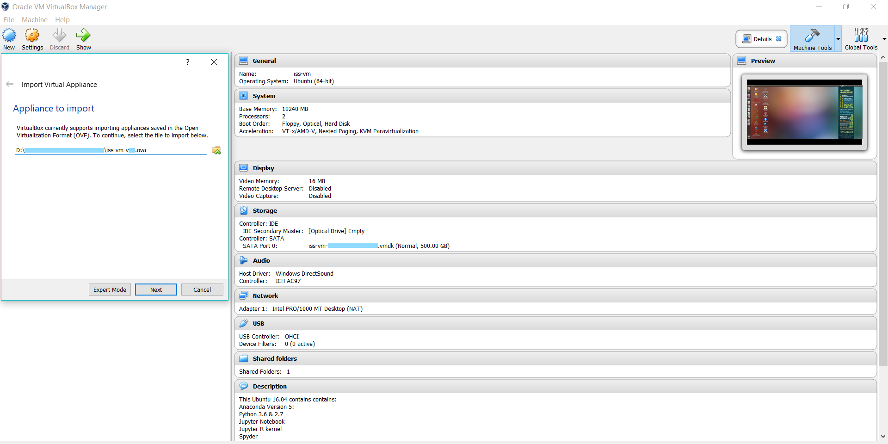
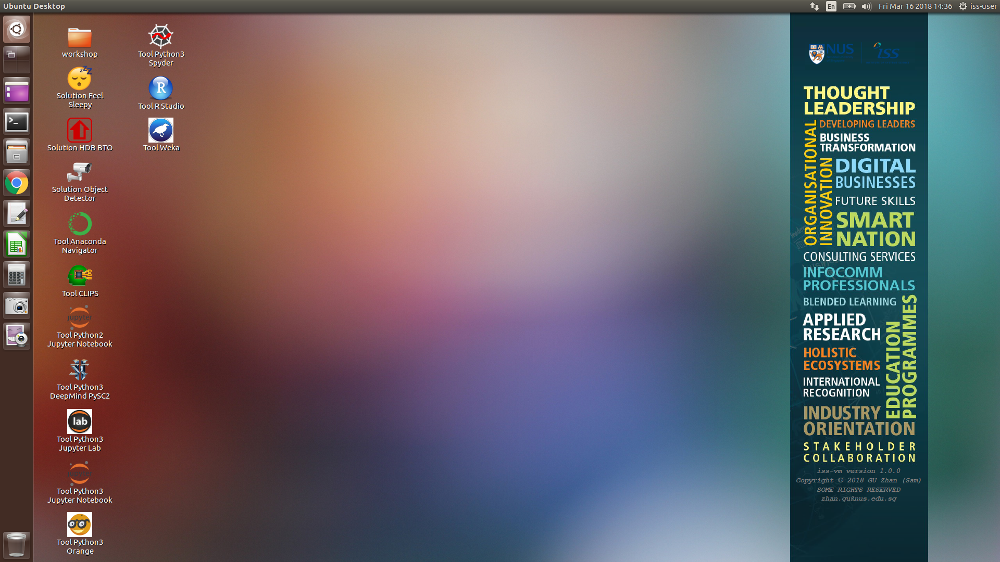


### 顾 瞻 GU Zhan (Sam)

zhan.gu@nus.edu.sg

# < User Guide for iss-vm >

### Installation steps:
* .1. Download and install Virtualbox software: https://www.virtualbox.org/wiki/Downloads
* .2. Download and iss-vm virtual machine (an Appliance) from: http://bit.ly/iss-vm-v13

* **[Note] Please check/ensure the 'virtualization' option is enabled in your computer's BIOS/hardware (Google it if not sure)**

* .3. Start Virtualbox software
* .4. Click File -> Import Appliance

* .5. Click Start to use iss-vm
* .6. Data science software are on the desktop

### This iss-vm Ubuntu 16.04 contains contains:

* Anaconda3-5.0.1-Linux-x86_64
* Python 3.6 in conda environment: iss-env-py3
* Python 2.7 in conda environment: iss-env-py2
* Jupyter Notebook
* Jupyter R kernel
* Spyder
* Orange3
* scikit-learn
* tensorflow
* pytorch
* keras
* conda
* pip
* nltk & nltk data : nltk.download('popular')
* R
* R Studio
* R Rattle
* CLIPS (Rule Based Expert System)
* Git (Git Bash)
* Solver (Nonlinear Programming / Genetic Algorithms) for LibreOffice
* MySQL
* Google Cloud SDK: gcloud & datalab 
* Google APIs Client Library for Python: google-api-python-client
* Weka
* DeepMind PySC2 - StarCraft II Learning Environment

---

linux machine name                  : iss-vm 

linux user id                       	: iss-user 

linux user password                	: iss-user 

anaconda python 3 environment : iss-env-py3 

anaconda python 2 environment : iss-env-py2 

MySQL user id                       	: iss-user 

MySQL user password                 	: iss-user 

MySQL root user id                  	: root 

MySQL root user password 	: iss-user 

---

VirtualBox shared folder in guest (iss-vm linux) operating system: /media/sf_vm_shared_folder 

VirtualBox shared folder in host operating system: D:\0020_vm_disk\vm_shared_folder 

To display linux/ubuntu keyboard shortcuts: Long hold of SUPER Key (WINDOWS Key)

---

Copyright © 2018 GU Zhan (Sam) 

SOME RIGHTS RESERVED

zhan.gu@nus.edu.sg

This iss-vm is free for personal usage; Please write to us for commercial usage enquiry.

### Your data scince road map

https://s3-eu-west-1.amazonaws.com/fayimora.com/2017/04/RoadToDataScientist1.png

---
